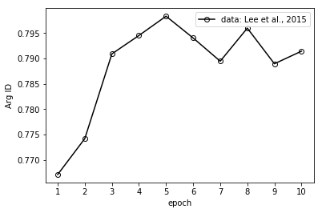

# BERT_for_Korean_SRL

## About
BERT_for_Korean_SRL is a semantic role labeling (SRL) module for Korean text. 
It is based on BERT model (`bert-base-multilingual-cased`) , and was trained by using the Korean PropBank data which is modified by Lee et al., (2015)

## prerequisite
* `python 3`
* `pytorch-pretrained-BERT` ([Link](https://github.com/huggingface/pytorch-pretrained-BERT))

## How to Install 
First, install `pytorch-pretrained-BERT`.
```
pip3 install pytorch-pretrained-bert
```
Second, copy a file `'./data/bert-multilingual-cased-dict-add-frames'` to your pytorch-pretrained-bert tokenizer's vocabulary.
Please follow this:
* (1) may your vocabulary is in `.pytorch-pretrained-bert`folder under your home. 
```
cd ~/.pytorch-pretrained-bert
```
* (2) make sure what file is a vocabulary file for `bert-base-multilingual-cased`. 
For example, if the url `https://s3.amazonaws.com/models.huggingface.co/bert/bert-base-multilingual-cased-vocab.txt` is in the file `9626...252.json` (file name would be different), another file with same name `9626...252` is the vocabulary file for `bert-base-multilingual-cased`.
* (3) copy the file `'./data/bert-multilingual-cased-dict-add-frames'` to that folder.
```
cp ./data/bert-multilingual-cased-dict-add-frames ~/.pytorch-pretrained-bert/9626...252
```
* (don't forget to make a back-up file for `9626...252`)

## How to use

**Download the pretrained model**

Download two pretrained model files to `{your_model_dir}` (e.g. `/home/model/bert_ko_srl_model.pt`). 
* **Download:** ([click](https://drive.google.com/open?id=1lmyFhrr77oNYZlo0sYsTJFz8stXscoEr))

**Import srl_based_parser (in your python code)**
(make sure that your code is in a parent folder of BERT_for_Korean_SRL)
```
from BERT_for_Korean_SRL import parser

model_dir = {your_model_dir} # absolute_path (e.g. /home/model/bert_ko_srl_model.pt)
srl_parser = parser.srl_parser(model_dir=model_dir)
```

**parse the input text**
```
text = '헤밍웨이는 1899년 7월 21일 미국 일리노이에서 태어났고 62세에 자살로 사망했다.'
parsed = srl_parser.ko_srl_parser(text)
```

**result**

The result is a list, which consists of multiple SRL structures. Each SRL structure is in a list, which consists of three lists: (1) tokens, (2) predicates, and (3) arguments. For example, for the given input text, the output is in the following format:

```
[ 
    [
        ['헤밍웨이는', '1899년', '7월', '21일', '미국', '일리노이에서', '태어났고', '62세에', '자살로', '사망했다.'], 
        ['_', '_', '_', '_', '_', '_', '태어나.v', '_', '_', '_'], 
        ['ARG0', 'O', 'O', 'ARGM-TMP', 'O', 'ARGM-LOC', 'O', 'O', 'O', 'O']
    ],

    [
        ['헤밍웨이는', '1899년', '7월', '21일', '미국', '일리노이에서', '태어났고', '62세에', '자살로', '사망했다.'], 
        ['_', '_', '_', '_', '_', '_', '_', '_', '_', '사망하.v'], 
        ['ARG1', 'O', 'O', 'O', 'O', 'O', 'O', 'ARGM-TMP', 'ARGM-PRD', 'O']
    ]
]
```
where the first annotation is a SRL for the verb '태어나.v', and second is for the verb '사망하.v'. 
The original dataset (Lee et al., 2015) is based on the dependency-based SRL. Each thematic role (e.g. ARG0) is annotated for a token which is a syntactic head of argument. 

## Performance

The model is evaluated for argument identification task, in terms of F1. At the epoch 5, F1 score is 79.83%. The model is available now. To the best of our knowledge, the state-of-the-art model is Bae et al., (2017), where F1 is 78.84%. 

## REFERENCE
Changki Lee, Soojong Lim, Hyunki Kim. Korean Semantic Role Labeling Using Structured SVM. In Proceddings of the KIISE Korea Computer Congress 2015, 42.2: 220-226. (in Korean)

Jangseong Bae, Changki Lee, Hyunki Kim. Korean Semantic Role Labeling with Highway BiLSTM-CRFs. HCLT, 2017, 159-162. (in Korean)

## Licenses
* `CC BY-NC-SA` [Attribution-NonCommercial-ShareAlike](https://creativecommons.org/licenses/by-nc-sa/2.0/)
* If you want to commercialize this resource, [please contact to us](http://mrlab.kaist.ac.kr/contact)

## Publisher
[Machine Reading Lab](http://mrlab.kaist.ac.kr/) @ KAIST

## Contact to author
Younggyun Hahm. `hahmyg@kaist.ac.kr`, `hahmyg@gmail.com`

## Acknowledgement
This work was supported by Institute for Information & communications Technology Promotion(IITP) grant funded by the Korea government(MSIT) (2013-0-00109, WiseKB: Big data based self-evolving knowledge base and reasoning platform)
